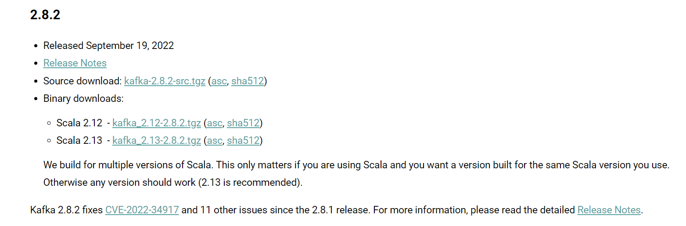
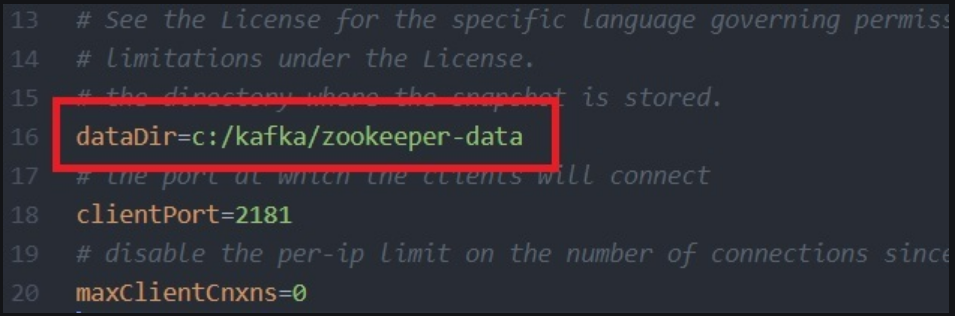
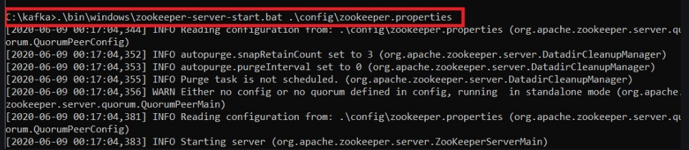
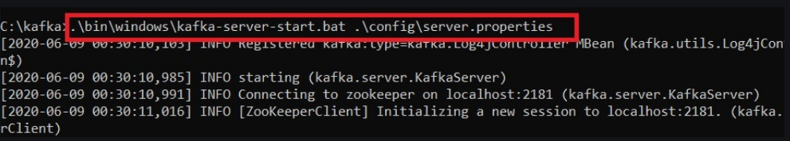

# springboot-kafka

#kafka installation
1. https://kafka.apache.org/downloads

 download anyone
   

2. Go to the Downloads folder and select the downloaded Binary file.

3.  Extract the file and move the extracted folder to the directory 
    where you wish to keep the files.

4. [OPTIONAL]Copy the path of the Kafka folder. 
   Now go to config inside kafka folder and open zookeeper.properties file. 
   Copy the path against the field dataDir and add /zookeeper-data to the path.
     e.g: C:/kafka_2.12-2.8.2/zookeeper-data
   

5. [OPTIONAL] Now in the same folder config open server.properties and scroll down to log.dirs 
   and paste the path. To the path add /kafka-logs
     e.g: C:/kafka_2.12-2.8.2/kafka-logs

6. START Zookeeper - open command prompt
   command: .\bin\windows\zookeeper-server-start.bat .\config\zookeeper.properties
   

7. START kafka server - open another command prompt
   command: .\bin\windows\kafka-server-start.bat .\config\server.properties
     

8. E:\kafka-logs\topic2-0\00000000000000000000.index -> E:\kafka-logs\topic2-0\00000000000000000000.index.deleted: 
   The process cannot access the file because it is being used by another process. Stopping serving replicas in 
   dir E:\kafka-logs (kafka.server.ReplicaManager)
   - comment #log.dirs=E:/kafka-logs

